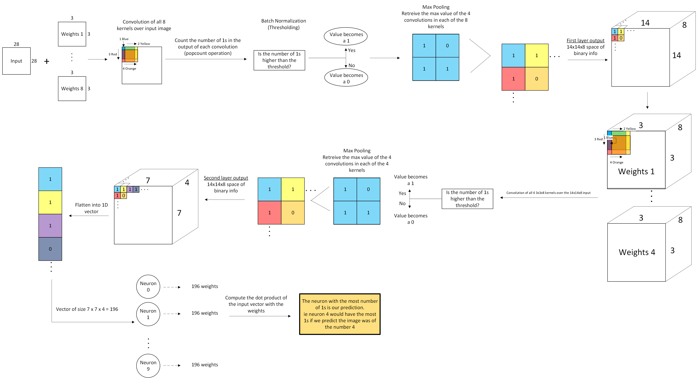
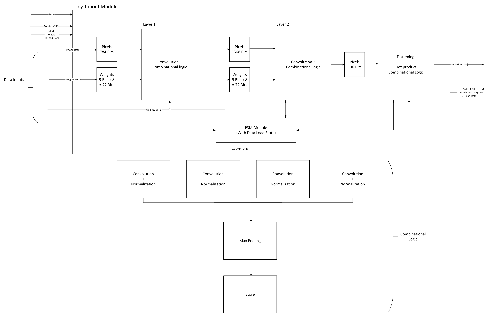

# BNN MNIST Digit Classifier — Tiny Tapeout

A Binary Neural Network (BNN) MNIST digit classifier implemented in SystemVerilog and taped out (attempted) via the Tiny Tapeout platform. The design accepts a 28×28 pixel image and a set of trained weights serially, runs inference through two binary convolutional layers and a dense output layer, and produces a 4-bit predicted digit (0–9).

---

## Why a BNN?

Binary Neural Networks replace floating-point multiply-accumulate with XNOR + popcount operations. This has several hardware advantages:

- **XNOR replaces multiply** — a single gate instead of a DSP block.
- **Popcount replaces accumulate** — efficiently counts matching bits with a small logic tree.
- **Batch normalization collapses to a threshold** — instead of scale-shift arithmetic, we just compare the popcount to a pre-computed integer threshold. No multipliers needed anywhere in the design.
- **Low area and power** — the result is a network that fits entirely within a 3×2 Tiny Tapeout tile (~501×216 µm) running at 300 kHz, with no multipliers and no floating-point logic.

The trade-off is some accuracy loss from quantization, but for MNIST digit classification this is well within acceptable bounds.

---

## Network Architecture

The network has three layers:

| Layer | Input | Output | Key Operations |
|---|---|---|---|
| Conv 1 | 28×28×1 | 14×14×8 | XNOR conv (8 filters, 3×3), threshold BatchNorm, 2×2 MaxPool |
| Conv 2 | 14×14×8 | 7×7×4 | XNOR conv (4 filters, 3×3), threshold BatchNorm, 2×2 MaxPool |
| Dense | 196 bits | 10 neurons | Binary dot product, winner-take-all → 4-bit index |

**Batch normalization** is implemented as a threshold on the per-filter popcount:
- Layer 1 thresholds (per filter): `[6, 5, 5, 6, 8, 8, 8, 6]` (max possible: 9)
- Layer 2 thresholds (per filter): `[41, 42, 35, 37]` (max possible: 72)

**Classification** is done by a tournament-style max-tree across the 10 dense layer neuron popcounts. The index of the winning neuron is the predicted digit.

---

## Hardware Architecture

The top-level module (`tt_um_mnist_bnn`) contains the following blocks:

- **`registers`** — receives pixel data (784 bits) and three sets of weights (72 + 288 + 1,960 bits) one bit per clock via serial inputs.
- **`fsm`** — sequences the design through five states: `IDLE → LOAD → LAYER_1 → LAYER_2 → LAYER_3`.
- **`layer_one`** — computes Conv 1. Iterates over 8 filters × 14×14 output positions, computing one output bit per clock cycle using combinational XNOR + popcount + threshold + max-pool logic.
- **`layer_two`** — computes Conv 2 similarly, over 4 filters × 7×7 output positions.
- **`flatten_layer`** — computes the final dense layer. Runs 10 binary dot products against the 196-bit flattened feature map and selects the maximum via a 4-round comparison tree.
- **`reset_pipe`** — 2-stage synchronizer for metastability-safe reset.

**Serial data totals:**

| Data | Bits |
|---|---|
| Pixels (28×28) | 784 |
| Layer 1 weights (8 × 3×3) | 72 |
| Layer 2 weights (4 × 3×3 × 8 ch) | 288 |
| Layer 3 weights (10 × 196) | 1,960 |
| **Total** | **3,104** |

---

## Training

The network is trained in Python using TensorFlow with binarized weights (±1, via a straight-through estimator). After training, `bnn_retrieve_weights.py` extracts the binarized weights and computes the per-layer BatchNorm thresholds, which are then used directly in the hardware.

Scripts in `src/Python311_training/`:

| Script | Purpose |
|---|---|
| `convert_mnist_binary.py` | Binarizes raw MNIST images (threshold at pixel value 127) into `.ubin` format |
| `mnist_bnn.py` | Trains the BNN (6 epochs, Adam, batch size 64), saves model to `.h5` |
| `bnn_retrieve_weights.py` | Extracts binarized weights and BatchNorm thresholds as CSV files |
| `bnn_test_layer.py` | Runs a specific MNIST image through the trained model and prints intermediate layer outputs for comparison with hardware |

---

## Testing

Every module was tested individually and compared against the expected output from the TensorFlow model. The testbench suite in `test/` covers:

- **`layer_one_tb/`** — validates Layer 1 convolution, batch normalization thresholding, and max pooling outputs, comparing each value to what the Python model produces.
- **`layer_two_tb/`** — same for Layer 2.
- **`flatten_layer_tb/`** — validates the dense layer dot products and winner-take-all output.
- **`fsm_tb/`** — verifies all FSM state transitions.
- **`top_tb/`** — cocotb-based integration test that feeds real binarized MNIST images through the full hardware pipeline.
- **`top_test_tb/`** — further integration tests with pre-generated memory files for pixels and weights, cross-referenced against TensorFlow predictions.

This level of per-layer validation was essential for catching numerical discrepancies early (e.g., threshold direction, weight bit ordering, index conventions between Python and Verilog).

---

## GDS / Synthesis Status

The current `main` branch design **cannot pass the GDS check**. During synthesis, LibreLane is killed with a SIGKILL error caused by the system running out of memory. The root cause is the combinational logic complexity: having all the XNOR + popcount operations across all filters and spatial positions in parallel generates a gate count that overwhelms the synthesizer.

The `integ.v2` branch contains an optimized version that addresses this by:

- **Hardcoding weights as `localparam`** rather than storing them in registers, eliminating thousands of flip-flops.
- **Making convolution sequential** rather than fully parallel — computing one filter position per clock cycle instead of all at once, dramatically reducing instantaneous combinational depth.
- **Reducing tile size** and adjusting the clock period in `config.json` to give the synthesizer more slack.

With these changes, the design **can be synthesized** and passes the LibreLane flow. However, this optimized version has not yet been fully tested yet due to time constraints, so it has not been merged to `main`. The artifact from it's GDS check can be seen in the Artifacts directory.

---

## Pin Reference

| Pin | Direction | Description |
|---|---|---|
| `ui[0]` | Input | Mode: `1` = Load, `0` = Run inference |
| `ui[1]` | Input | Pixel data (serial, 1 bit per clock, row-major) |
| `ui[2]` | Input | Weight data (serial, 1 bit per clock) |
| `uo[3:0]` | Output | Predicted digit 0–9 |

## How to Test

1. Assert reset (`rst_n = 0`) then release (`rst_n = 1`).
2. Set `ui[0] = 1` (load mode).
3. Clock in 784 pixel bits on `ui[1]` (row-major, MSB first).
4. Clock in weight bits on `ui[2]`: 72 bits for Layer 1, then 288 for Layer 2, then 1,960 for Layer 3.
5. Set `ui[0] = 0` — the FSM begins inference automatically.
6. Read the predicted digit from `uo[3:0]` once inference completes.
